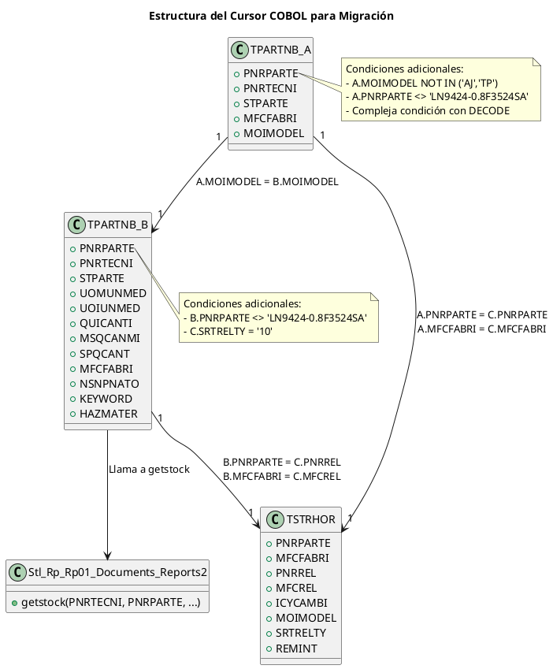

```plantuml
@startuml
title Estructura del Cursor COBOL para Migración

class TPARTNB_A {
  + PNRPARTE
  + PNRTECNI
  + STPARTE
  + MFCFABRI
  + MOIMODEL
}

class TPARTNB_B {
  + PNRPARTE
  + PNRTECNI
  + STPARTE
  + UOMUNMED
  + UOIUNMED
  + QUICANTI
  + MSQCANMI
  + SPQCANT
  + MFCFABRI
  + NSNPNATO
  + KEYWORD
  + HAZMATER
}

class TSTRHOR {
  + PNRPARTE
  + MFCFABRI
  + PNRREL
  + MFCREL
  + ICYCAMBI
  + MOIMODEL
  + SRTRELTY
  + REMINT
}

TPARTNB_A "1" --> "1" TSTRHOR : A.PNRPARTE = C.PNRPARTE\nA.MFCFABRI = C.MFCFABRI
TPARTNB_B "1" --> "1" TSTRHOR : B.PNRPARTE = C.PNRREL\nB.MFCFABRI = C.MFCREL
TPARTNB_A "1" --> "1" TPARTNB_B : A.MOIMODEL = B.MOIMODEL

note right of TPARTNB_A::PNRPARTE
  Condiciones adicionales:
  - A.MOIMODEL NOT IN ('AJ','TP')
  - A.PNRPARTE <> 'LN9424-0.8F3524SA'
  - Compleja condición con DECODE
end note

note left of TPARTNB_B::PNRPARTE
  Condiciones adicionales:
  - B.PNRPARTE <> 'LN9424-0.8F3524SA'
  - C.SRTRELTY = '10'
end note

class Stl_Rp_Rp01_Documents_Reports2 {
  + getstock(PNRTECNI, PNRPARTE, ...)
}

TPARTNB_B --> Stl_Rp_Rp01_Documents_Reports2 : Llama a getstock
@enduml
```

```plantuml
@startuml
title Estructura del Cursor COBOL para Migración

class TPARTNB_A {
  + PNRPARTE
  + PNRTECNI
  + STPARTE
  + MFCFABRI
  + MOIMODEL
}

class TPARTNB_B {
  + PNRPARTE
  + PNRTECNI
  + STPARTE
  + UOMUNMED
  + UOIUNMED
  + QUICANTI
  + MSQCANMI
  + SPQCANT
  + MFCFABRI
  + NSNPNATO
  + KEYWORD
  + HAZMATER
}

class TSTRHOR {
  + PNRPARTE
  + MFCFABRI
  + PNRREL
  + MFCREL
  + ICYCAMBI
  + MOIMODEL
  + SRTRELTY
  + REMINT
}

TPARTNB_A "1" --> "1" TSTRHOR : A.PNRPARTE = C.PNRPARTE\nA.MFCFABRI = C.MFCFABRI
TPARTNB_B "1" --> "1" TSTRHOR : B.PNRPARTE = C.PNRREL\nB.MFCFABRI = C.MFCREL
TPARTNB_A "1" --> "1" TPARTNB_B : A.MOIMODEL = B.MOIMODEL

note right of TPARTNB_A::PNRPARTE
  Condiciones adicionales:
  - A.MOIMODEL NOT IN ('AJ','TP')
  - A.PNRPARTE <> 'LN9424-0.8F3524SA'
  - Compleja condición con DECODE
end note

note left of TPARTNB_B::PNRPARTE
  Condiciones adicionales:
  - B.PNRPARTE <> 'LN9424-0.8F3524SA'
  - C.SRTRELTY = '10'
end note

class Stl_Rp_Rp01_Documents_Reports2 {
  + getstock(PNRTECNI, PNRPARTE, ...)
}

TPARTNB_B --> Stl_Rp_Rp01_Documents_Reports2 : Llama a getstock
@enduml
```